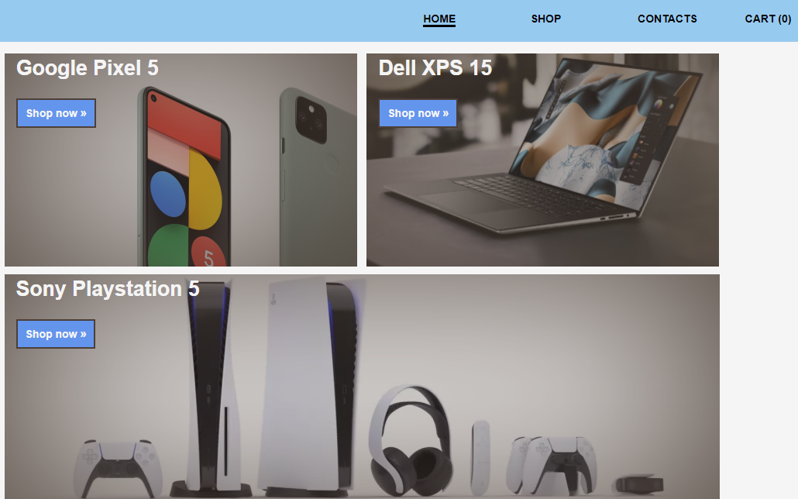
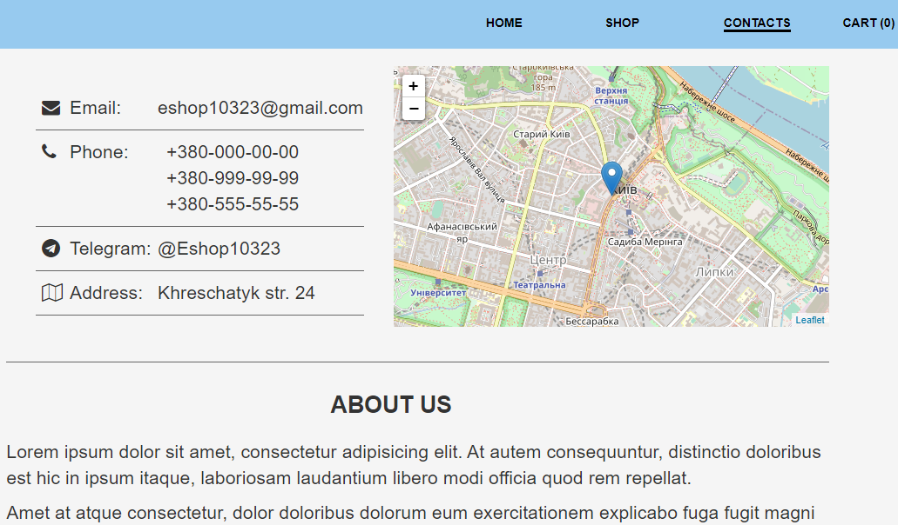
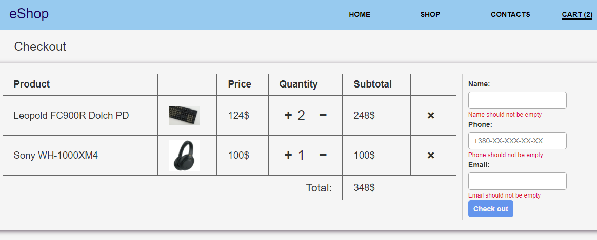
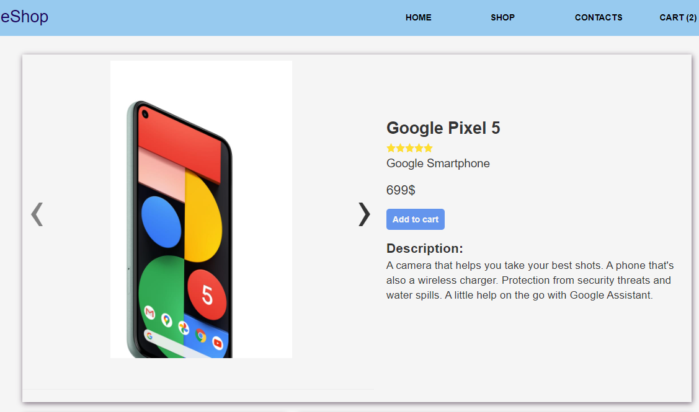
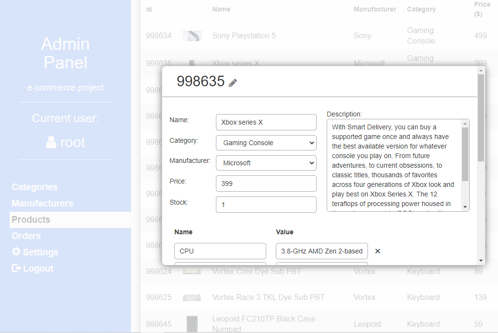
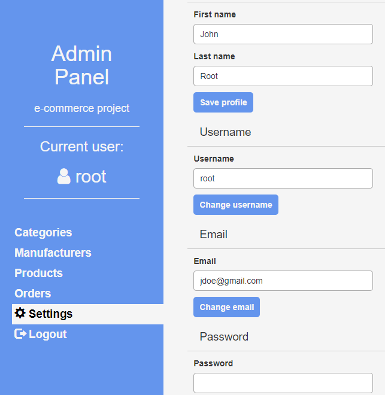

## Front end for E-commerce project

#### General
This is a front end for the e-commerce website. 
Current revision (v2.0) is the last, and it introduces the following changes:
 - Admin panel
 - Authentication and authorization mechanism
 - Classes replaced by functional components and hooks 
 - Code is cleaner
 - Improved performance 

Back end can be found [here](https://github.com/Leenocktopus/ecommerce-project-API).

Technologies used: *React.js, CSS, JavaScript, HTML, Redux, Axios.*

#### Website description 
On the regular user side of view, the website is alike any other 
store's website. Most of the functions and pages are pretty much
what one might expect from an e-commerce platform.  
The navigation panel guides a user to the existing pages:
 - **Home**
 
 Main page that consists of the promotional banners with links to the product pages.
  
  
  
 - **Shop page** 
 
 Shop page provides a list of products available in the store as well as filter, search and sort functions.
  
  
  
 - **Contacts page** 
 
 A page with contact information and short "About us" section
  
  
 
 - **Cart page** 

 Cart page provides functionality to manage the cart and check out orders
  
  

Additionally, each product has its own page, that embodies the following sections: 
 
 - **Product information section** 
 
 The product information section provides main characteristics of the products, such as 
 brand, category, name, price, average rating and description
 
 
 
 - **Product attributes and reviews sections** 
 
 Product attributes section consists of a number of secondary attributes 
 (e.g., weight, display resolution or processing power) that describe the product. 
 Reviews section consists of customer reviews, and a form which can be used to leave a review.
 

#### Authentication&Authorization
Authentication of admins built upon the functionality that is provided by the
back end. That is, the front end stores the authentication
token in memory and uses "/refresh" endpoint to restore it if the page was refreshed or 
closed, as well as in an event of token expiration. 

Authorization system based on usage of react-router 
redirects logged out users to the login form, even if they typed a URL that leads to the admin panel. 
In the same fashion, logged in users redirected to the admin panel if they are to visit login form.

#### Admin Panel
The admin panel is essentially a tool to perform CRUD operations 
on the existing entries about categories, manufacturers, 
orders and products.

Also, each admin can modify his own data on the settings 
page (first name and last name, email, password and username). 

#### Design
The design is somewhat simplistic (I'm not a designer),
but it could be improved upon if the need arises. The first 
version of this website featured a responsive layout, but 
it was detrimental to the quality of the code and 
made the whole front end kind of convoluted. The current design is 
a lot cleaner and modular, and while it doesn't make the website
look more beautiful, styles are much easier to refactor. 
 
